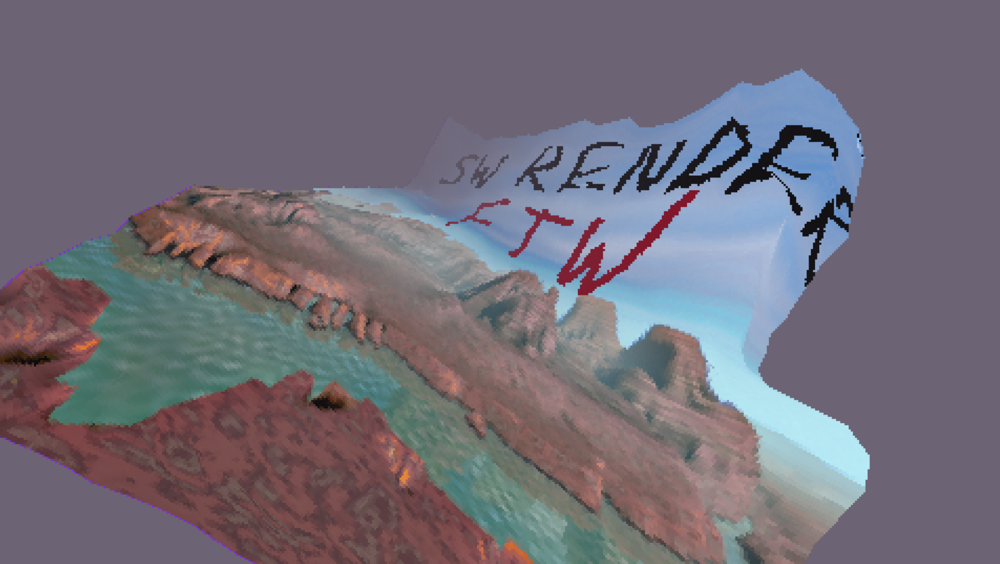

# sw3d

Software rasterizer framework implemented using fixed-point arithmetic.

## Features: ##
  * Scanline based triangle rasterization
  * Customizable vertex and interpolated parameters format
  * Customizable vertex and pixel "shaders"
  * Perspective-correct interpolation
  * Backface culling
  * Depth testing and clipping
  * Nearest-neighbour texture sampling
  * RGB888/RGB565 Bitmap texture loading and sampling
  * Uses s15.16 fixed-point arithmetic for the whole rendering pipeline
  * 4D vector and 4x4 matrix routines
